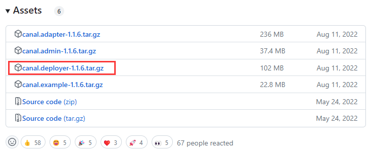
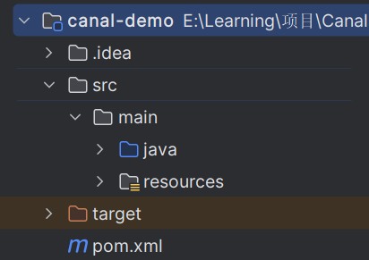
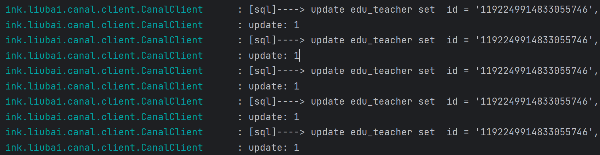

# 简介

Canal 是 Alibaba 开发的用于实现数据库之间进行**数据增量同步**的工具。

简单来说，就是 A 数据库对其中的数据表进行了任何操作，则会实时同步到 B 数据库的相同数据表中去。

说起来，这是不是有点像主从复制的感觉，没错，其实 Canal 的原理就是把自己伪装成主数据库的从数据库，当主数据发生了操作时，Canal 就会模拟从数据库获取操作记录然后交给客户端进行处理。

需要注意的是，Canal 是做数据增量同步的工具，而不是全量同步的工具，所以在对两个数据库进行同步之前，应该保证两个数据库中的数据是一致的。

更多详细内容可以参考 [Canal 的 Github 地址](https://github.com/alibaba/canal)。

# 准备操作

安装 Canal 前需要安装 MySQL 并开启 MySQL 的 binlog，如何安装 MySQL 此处不进行演示，可以百度自行安装，我这里的版本是 8.0.22。

在 MySQL 的配置文件 `my.cnf` 中添加如下信息：

```ini
[mysqld] 
# 打开binlog 
log-bin=mysql-bin 
# 选择ROW(行)模式 
binlog-format=ROW 
# 配置MySQL replaction需要定义，不要和canal的slaveId重复 
server_id=1
```

保存修改后重启 MySQL 服务，允许如下命令查看 biglog 是否启动。

```mysql
SHOW VARIABLES LIKE 'log_bin';
```

| Variable_name | Value |
| ------------- | ----- |
| log_bin       | ON    |

创建 MySQL 用户用于数据同步。

```mysql
# 新建用户 用户名：canal  密码：canal 
CREATE USER canal IDENTIFIED by 'canal';
# 授权
GRANT SELECT, REPLICATION SLAVE, REPLICATION CLIENT ON *.* TO 'canal'@'%';
# 刷新MySQL的系统权限相关表
FLUSH PRIVILEGES;
```

> **Tips：**
>
> 在 8.0.22 中可能还会出现一个问题，因为在这个版本中密码使用 `caching_sha2_password` 方式加密的，但是用这种方式在 canal 启动后会报错：`Caused by: java.io.IOException: caching_sha2_password Auth failed` 。
>
> 为了避免上述错误，可以在创建用户后执行以下代码修改加密方式：
>
> ```mysql
> ALTER USER 'canal'@'%' IDENTIFIED WITH mysql_native_password BY 'canal';
> FLUSH PRIVILEGES;
> ```

# Canal 下载

## 常规方式

github 下载地址：https://github.com/alibaba/canal/releases。不建议下载 `Pre-release` 的版本，可以下载 `Latest` 版本或者之前版本。



## Docker 下载

拉取镜像：

```sh
$ docker pull canal/canal-server
```

启动镜像以获取配置文件：

```sh
$ docker run -p 11111:11111 --name canal-server -d canal/canal-server:latest
$ mkdir -p /usr/local/docker/canal
$ docker cp canal-server:/home/admin/canal-server/ /usr/local/docker/canal/
$ ls /usr/local/docker/canal # 显示如下内容表示成功
canal-server
```

修改配置文件：

```sh
$ cd /usr/local/docker/canal/canal-server/conf/example/
$ cp instance.properties instance.properties.bak # 备份配置文件
$ vim instance.properties
```

```
#需要改成自己的数据库信息
canal.instance.master.address=172.17.0.4:3306

#需要改成自己的数据库用户名与密码
canal.instance.dbUsername=canal
canal.instance.dbPassword=canal

#需要改成同步的数据库表规则，例如只是同步一下表
#canal.instance.filter.regex=.*\\..*
canal.instance.filter.regex=guli_ucenter.ucenter_member
```

> **Tips：**如果你的数据库也是用 Docker 安装的，数据库信息中请填写容器内的的 IP，数据库容器的 IP 可以通过 `docker inspect mysql-server | tail -n 15` 得到，`mysql-server` 为自己的容器名，不要照抄。

删除原服务，启动新服务：

```sh
$ docker rm -f canal-server
canal-server
$ docker run -d -p 11111:11111 \
--name canal-server \
-v /usr/local/docker/canal/conf/example/:/home/admin/canal-server/conf/example/ \
--restart=always \
canal/canal-server:latest
```


# Java 客户端

由于 Canal 安装在 Linux 服务器上，所以下面演示的是把 Linux 服务器中的 MySQL 数据库同步到本机(Windows)中的 MySQL 数据库。

## 创建项目

创建一个 SpringBoot 项目，目录结构如下：



## 引入依赖

```xml
<dependencies>
    <dependency>
        <groupId>org.springframework.boot</groupId>
        <artifactId>spring-boot-starter-web</artifactId>
    </dependency>
    <!--mysql-->
    <dependency>
        <groupId>mysql</groupId>
        <artifactId>mysql-connector-java</artifactId>
    </dependency>
    <dependency>
        <groupId>commons-dbutils</groupId>
        <artifactId>commons-dbutils</artifactId>
        <version>1.7</version>
    </dependency>
    <dependency>
        <groupId>org.springframework.boot</groupId>
        <artifactId>spring-boot-starter-jdbc</artifactId>
    </dependency>
    <dependency>
        <groupId>com.alibaba.otter</groupId>
        <artifactId>canal.client</artifactId>
        <version>1.1.0</version>
    </dependency>
    <dependency>
        <groupId>org.projectlombok</groupId>
        <artifactId>lombok</artifactId>
    </dependency>
</dependencies>
```

## 编写配置文件

在 `resource` 目录下，创建以下两个文件。

- `application.yml` ：

```yaml
server:
  port: 10000
spring:
  application:
    name: canal-demo
  profiles:
    active: dev
```

- `application-dev.yml` ：

```yaml
spring:
  # 数据库配置
  datasource:
    driver-class-name: com.mysql.cj.jdbc.Driver
    username: root
    password: 123456
    url: jdbc:mysql://localhost:3306/guli_college?&useSSL=false&serverTimezone=GMT%2B8&rewriteBatchedStatements=true
canal:
  hostname: 192.168.254.129
  port: 11111
```

## 编写代码

`CanalProperties` 类用于读取配置文件中的信息：

```java
@Component
@Data
@ConfigurationProperties(prefix = "canal")
public class CanalProperties {
    private String hostname;
    private Integer port;
}
```

`CanalClient` 类作为 canal 的客户端，其中的 `run()` 方法是入口方法，其中有一个 `while` 死循环，在这个循环中会不停的去主数据库去拉取记录。

- 如果未拉取到记录，程序休眠 1s 后重复拉取操作。
- 如果拉取到记录，执行 `dataHandle()` 方法，这个方法会根据记录的操作类型(insert、update、delete)封装出不同的 sql 语句并加入到 `SQL_QUEUE` 队列，当 `dataHandle()` 方法处理完成后，若 `SQL_QUEUE` 队列中有 sql 语句，则通过 `executeQueueSql()` 方法执行队列中的 sql 语句。

整体的逻辑并不复杂，详细的代码如下：

```java
import com.alibaba.otter.canal.client.CanalConnector;
import com.alibaba.otter.canal.client.CanalConnectors;
import com.google.protobuf.InvalidProtocolBufferException;
import ink.liubai.canal.domain.properties.CanalProperties;
import lombok.extern.slf4j.Slf4j;
import org.apache.commons.dbutils.DbUtils;
import org.apache.commons.dbutils.QueryRunner;
import org.springframework.beans.factory.annotation.Autowired;
import org.springframework.stereotype.Component;
import com.alibaba.otter.canal.protocol.Message;
import com.alibaba.otter.canal.protocol.CanalEntry.*;

import javax.sql.DataSource;
import java.net.InetSocketAddress;
import java.sql.Connection;
import java.sql.SQLException;
import java.util.List;
import java.util.Queue;
import java.util.concurrent.ConcurrentLinkedQueue;

@Component
@Slf4j
public class CanalClient {

    // SQL 队列
    private final Queue<String> SQL_QUEUE = new ConcurrentLinkedQueue<>();

    // SQL 数据源
    @Autowired
    private DataSource dataSource;

    // canal 配置
    @Autowired
    private CanalProperties canalProperties;

    /**
     * canal入库方法
     */
    public void run() {
        CanalConnector connector = CanalConnectors.newSingleConnector(new InetSocketAddress(canalProperties.getHostname(), canalProperties.getPort()),
                "example", "", "");
        int batchSize = 1000;
        try {
            connector.connect();
            connector.subscribe(".*\\..*");
            connector.rollback();
            try {
                while (true) {
                    // 尝试从 master 那边拉去数据 batchSize 条记录，有多少取多少
                    Message message = connector.getWithoutAck(batchSize);
                    long batchId = message.getId();
                    int size = message.getEntries().size();
                    if (batchId == -1 || size == 0) {
                        Thread.sleep(1000);
                    } else {
                        dataHandle(message.getEntries());
                    }
                    connector.ack(batchId);
                    // 当队列里面堆积的sql大于一定数值的时候就模拟执行
                    if (SQL_QUEUE.size() >= 1) {
                        executeQueueSql();
                    }
                }
            } catch (InterruptedException e) {
                e.printStackTrace();
            } catch (InvalidProtocolBufferException e) {
                e.printStackTrace();
            }
        } finally {
            connector.disconnect();
        }
    }

    /**
     * 数据处理
     *
     * @param entrys
     */
    private void dataHandle(List<Entry> entrys) throws InvalidProtocolBufferException {
        for (Entry entry : entrys) {
            if (EntryType.ROWDATA == entry.getEntryType()) {
                RowChange rowChange = RowChange.parseFrom(entry.getStoreValue());
                EventType eventType = rowChange.getEventType();
                // 判断操作类型，并执行对应操作
                if (eventType == EventType.DELETE) {
                    saveDeleteSql(entry);
                } else if (eventType == EventType.UPDATE) {
                    saveUpdateSql(entry);
                } else if (eventType == EventType.INSERT) {
                    saveInsertSql(entry);
                }
            }
        }
    }

    /**
     * 模拟执行队列里面的sql语句
     */
    public void executeQueueSql() {
        int size = SQL_QUEUE.size();
        for (int i = 0; i < size; i++) {
            String sql = SQL_QUEUE.poll();
            log.info("[sql]----> " + sql);
            this.execute(sql.toString());
        }
    }

    /**
     * 入库
     * @param sql
     */
    public void execute(String sql) {
        Connection con = null;
        try {
            if(null == sql) return;
            con = dataSource.getConnection();
            QueryRunner qr = new QueryRunner();
            int row = qr.execute(con, sql);
            log.info("update: "+ row);
        } catch (SQLException e) {
            e.printStackTrace();
        } finally {
            DbUtils.closeQuietly(con);
        }
    }

    /**
     * 保存更新语句
     *
     * @param entry
     */
    private void saveUpdateSql(Entry entry) {
        try {
            RowChange rowChange = RowChange.parseFrom(entry.getStoreValue());
            List<RowData> rowDatasList = rowChange.getRowDatasList();
            for (RowData rowData : rowDatasList) {
                List<Column> newColumnList = rowData.getAfterColumnsList();
                StringBuffer sql = new StringBuffer("update " + entry.getHeader().getTableName() + " set ");
                for (int i = 0; i < newColumnList.size(); i++) {
                    sql.append(" " + newColumnList.get(i).getName()
                            + " = '" + newColumnList.get(i).getValue() + "'");
                    if (i != newColumnList.size() - 1) {
                        sql.append(",");
                    }
                }
                sql.append(" where ");
                List<Column> oldColumnList = rowData.getBeforeColumnsList();
                for (Column column : oldColumnList) {
                    if (column.getIsKey()) {
                        //暂时只支持单一主键
                        sql.append(column.getName() + "=" + column.getValue());
                        break;
                    }
                }
                SQL_QUEUE.add(sql.toString());
            }
        } catch (InvalidProtocolBufferException e) {
            e.printStackTrace();
        }
    }

    /**
     * 保存删除语句
     *
     * @param entry
     */
    private void saveDeleteSql(Entry entry) {
        try {
            RowChange rowChange = RowChange.parseFrom(entry.getStoreValue());
            List<RowData> rowDatasList = rowChange.getRowDatasList();
            for (RowData rowData : rowDatasList) {
                List<Column> columnList = rowData.getBeforeColumnsList();
                StringBuffer sql = new StringBuffer("delete from " + entry.getHeader().getTableName() + " where ");
                for (Column column : columnList) {
                    if (column.getIsKey()) {
                        //暂时只支持单一主键
                        sql.append(column.getName() + "=" + column.getValue());
                        break;
                    }
                }
                SQL_QUEUE.add(sql.toString());
            }
        } catch (InvalidProtocolBufferException e) {
            e.printStackTrace();
        }
    }

    /**
     * 保存插入语句
     *
     * @param entry
     */
    private void saveInsertSql(Entry entry) {
        try {
            RowChange rowChange = RowChange.parseFrom(entry.getStoreValue());
            List<RowData> rowDatasList = rowChange.getRowDatasList();
            for (RowData rowData : rowDatasList) {
                List<Column> columnList = rowData.getAfterColumnsList();
                StringBuffer sql = new StringBuffer("insert into " + entry.getHeader().getTableName() + " (");
                for (int i = 0; i < columnList.size(); i++) {
                    sql.append(columnList.get(i).getName());
                    if (i != columnList.size() - 1) {
                        sql.append(",");
                    }
                }
                sql.append(") VALUES (");
                for (int i = 0; i < columnList.size(); i++) {
                    sql.append("'" + columnList.get(i).getValue() + "'");
                    if (i != columnList.size() - 1) {
                        sql.append(",");
                    }
                }
                sql.append(")");
                SQL_QUEUE.add(sql.toString());
            }
        } catch (InvalidProtocolBufferException e) {
            e.printStackTrace();
        }
    }
    
}
```

## 启动类

启动类需要实现 `CommandLineRunner` 接口，这个接口也有个 `run()` 方法，在这个 `run()` 方法中，我们需要调用上面编写好的 `canalClient.run()` 方法。

```java
@SpringBootApplication
public class CanalApplication implements CommandLineRunner {

    @Autowired
    private CanalClient canalClient;

    public static void main(String[] args) {
        SpringApplication.run(CanalApplication.class, args);
    }

    @Override
    public void run(String... args) throws Exception {
        // 项目启动，执行canal客户端监听
        canalClient.run();
    }

}
```

## 测试

运行程序后，在装有 canal 的 Linux 服务器中修改 MySQL 数据库中的数据，若本机的相同数据表中的数据也发生了变化，说明程序执行成功。

通过程序的控制台，我们也可以发现这点。


